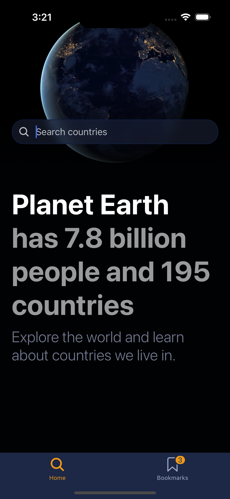

# Planet Earth Explorer

Explore the world and learn about countries we live in.



## Getting Started

### Prerequisites

- Node.js (v14 or later)
- npm or yarn

### Installation

1. Clone the repository:

   ```
   git clone https://github.com/indriks/earth.git
   cd earth
   ```

2. Install dependencies:
   ```
   npm install
   ```

### Running the Project

To start the development server:

```
   npm start
```

Open the app on your device using the Expo Go app or run it in a simulator.

### Testing

Run tests with:

```
   npm test
```

## Key Libraries

- React Native: Cross-platform mobile app development
- Expo: Simplified React Native development and deployment
- Jotai atom: State management

## License

This project is licensed under the MIT License - see the [LICENSE](LICENSE) file for details.
